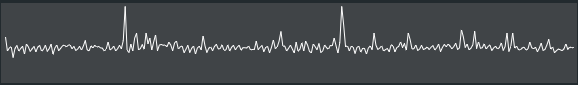

# c++ circular buffer

  

## Usage

- header only file : [circular_buffer.h](src/circular_buffer/public/circular_buffer.h)
- ideally used to keep the last values while tracking a variable

	
## Installation

- for the all project solution generation will be used premake. 
- run **scripts/generate_solution.bat**
- build **solution.sln**

## Properties

* forward iterable
* not thread safe

## License

Modified BSD License (3-Clause BSD license) see the file LICENSE in the project root.
